# Mnaual de Instalação e Uso Complemento

## Dynamic Field Customer User 

## O que este Add On faz

Este aAdd On cria todos os mecanismos necessários dentro do sistema OTRS para criação de um novo campo dinâmico que permite inserir uma lista de clientes no ticket.

## Instalação

Realize a instalação deste Add On através do Gerenciamento de Pacotes do OTRS acessando *Admin*:

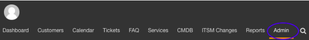

Em *Administration* selecione a opção *Package Manager*:

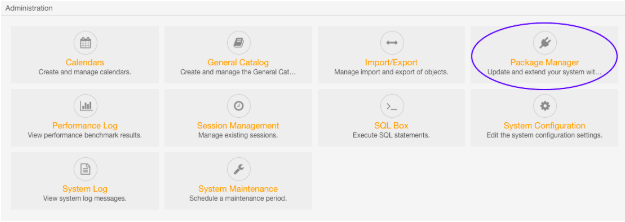

Em seguida, escolha o pacote do módulo *"DynamicFieldCustomerUser-6.0.opm"* e clique em *Install Package*

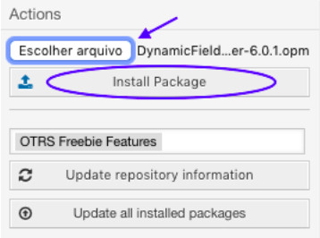

## Configurando o AddOn 

Logo após a isntalação do AddOn, precisamos definir algumas configurações, para isso devemos acessar os seguintes passos __Admin->Processes & Automation-> Dynamic Field__, ou faça uma pesquisa no campo *Filter for Items*, por "Dynamic Fields".

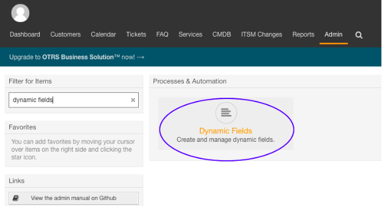

Este AddOn funciona para ações de Ticket e/ou Artigos.

No quadro *Actions* logo abaixo de "Ticket" selecione __CustomerUserReference__:

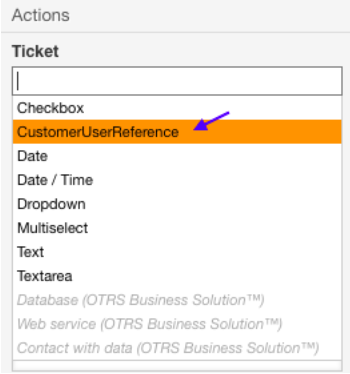

Preencha os campos selecionando a validade e o tipo de entrada, clique __Save__:

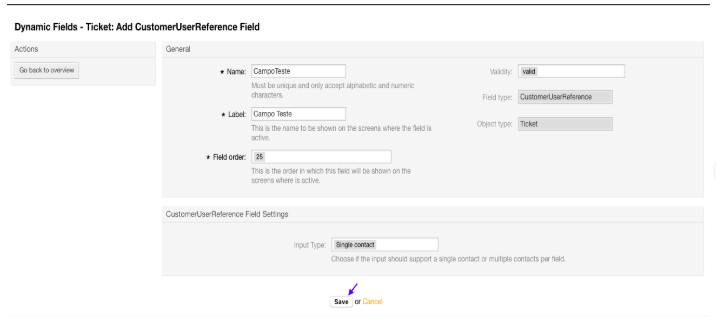

Após salvar será necessário vincular o Dynamic Field na tela de ticket, para isso acesse o seguinte:

__Admin->Adiministration->System Configuration__:

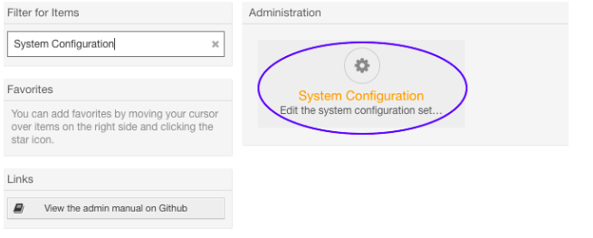

Aqui neste ponto, à esquerda em *Navegation* clique na seta __Frontend->Agent->View__:

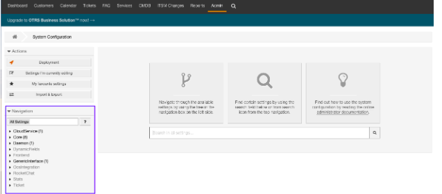

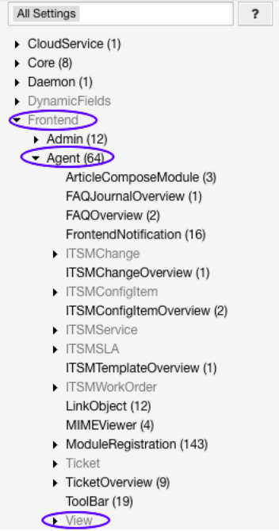

É possível adicionar o Dynamic Field em Tickets criados via telefone, via E-mail ou via Cliente, basta selecionar *TicketEmailNew* ou *TicketPhoneNew* ou qualquer outra desejada:

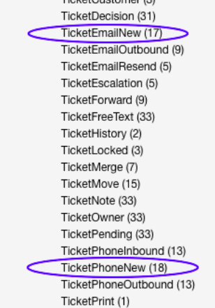

Tickets via Cliente clique na seta __Customer->View__ e selecione *TicketMessage*:

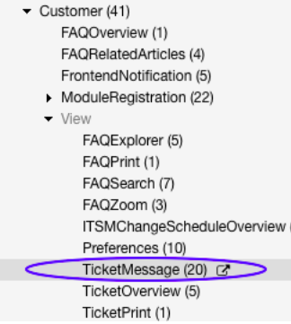

Nesta página no campo "Ticket::Frontend::AgentTicketPhone###DynamicField" clique em *Edit this setting*:

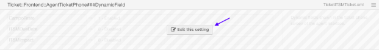

Para adicionar o novo clique no icone __+__, insira o nome que deseja no Dynamic Field e clique no visto verde:

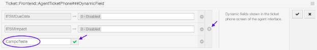

Selecione *Enabled* para habilitar o Dynamic Field:

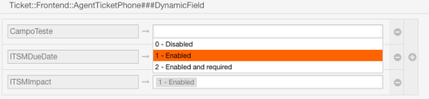

Para salvar clique no visto verde no canto superior direito:

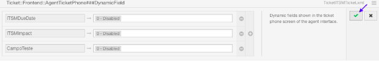

Para concluir clique na mensagem laranja que aparece na superfície da página:

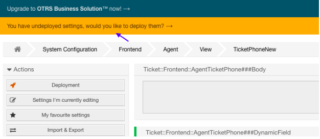

Clique em *Deploy selected changes*:

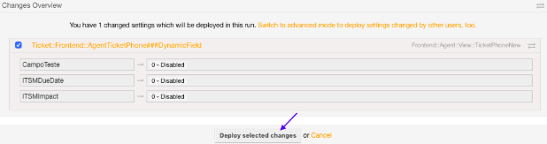

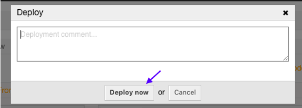

Para visualizar o Dynamic Field no ticket, clique novamente em *System Configuration*:

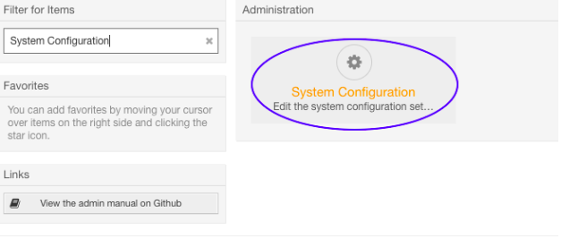

Na seta __Frontend->View->Ticket Zoom__:

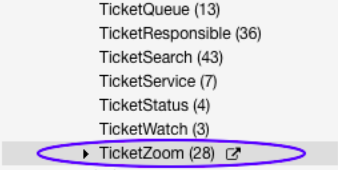

No campo "Ticket::Frontend::AgentTicketZoom###DynamicField", clique em *Edit this setting*:

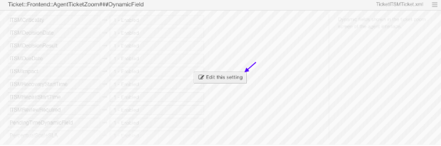

Adicione o Dynamic Field e em seguida clique no visto verde:

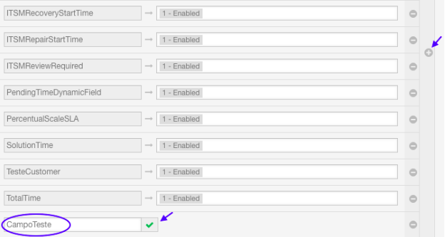

Habilite o Dynamic Field e grave:

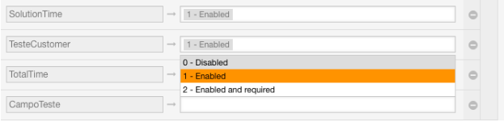

Para concluir clique na mensagem laranja que aparece na suerficíe da página:

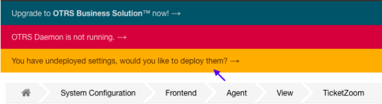

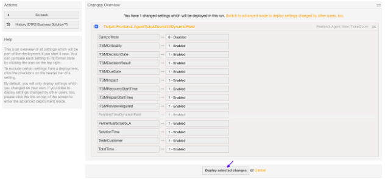

Clique em *Deploy now*:

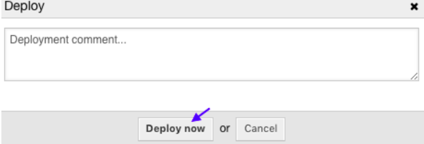

## Como Utilizar

Após configurado o Dynamic Field surgirá na página de criação de ticket para ser utilização, clique em __Ticket -> New phone tcket (ou New email ticket):

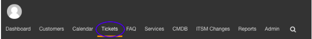

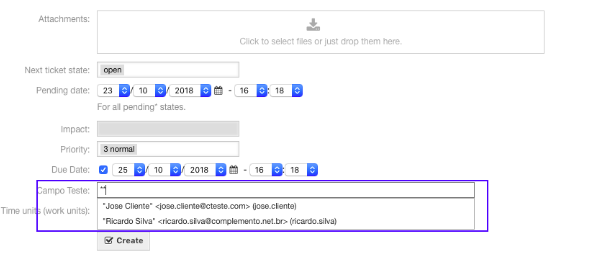

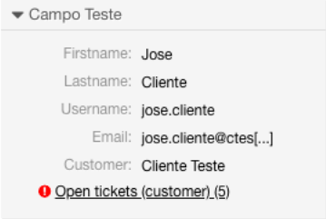

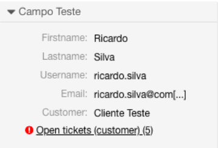